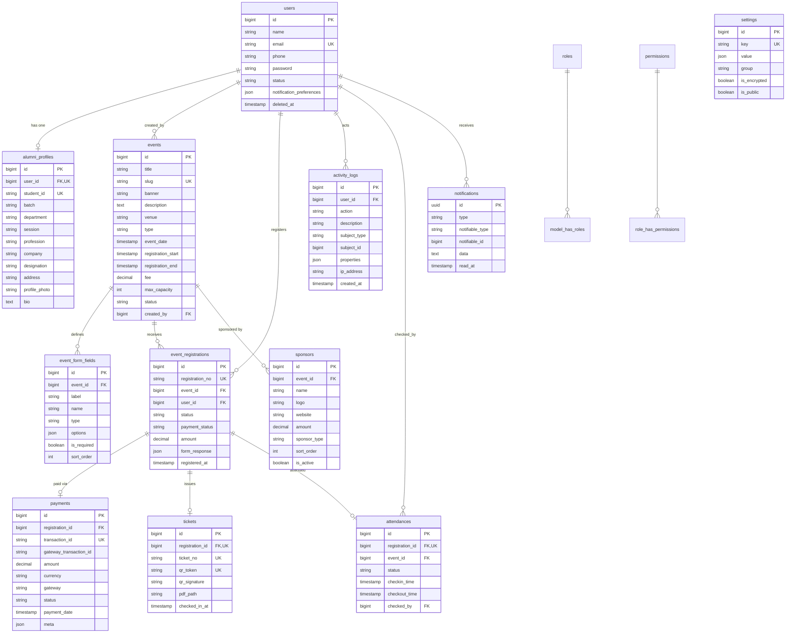

# Entity Relationship Diagram

Rendered with Mermaid (GitHub renders this natively).

## Relationship summary

- **1 User ↔ 1 AlumniProfile** (unique `user_id`).
- **1 Event → N Registrations → (0..1 Payment, 0..1 Ticket, 0..1 Attendance)**.
- **1 Event → N FormFields** (dynamic registration form) and **N Sponsors**.
- **Users ↔ Roles ↔ Permissions** via Spatie pivot tables.
- **notifications** is polymorphic (`notifiable`), **activity_logs** has a
  polymorphic `subject`.
